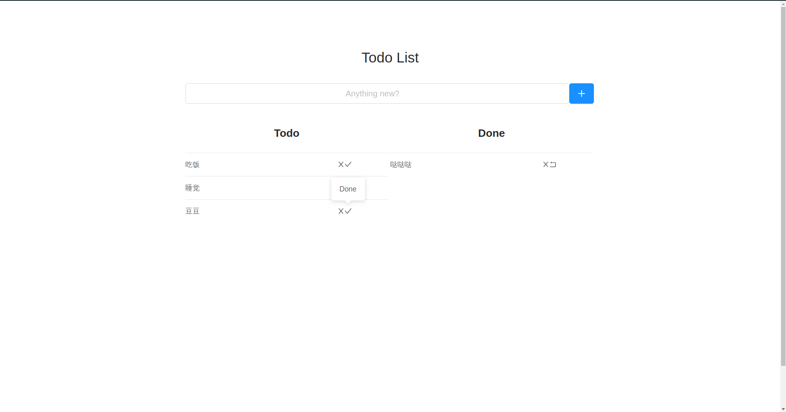

# TodoList

## 废话

事实证明，再大型的项目中`redux`才会表现其卓越性，在这个简单的TodoList上则显得反而不如原始框架数据操作来得快。（可能是技术不够）

事实证明，我的确是懒，没有多分离几个组件，全部都放到了`App.js`中，就连`App.js`也不是创建的，而是把原来文件内容删掉后重写的。

事实证明，AntD的确很好看。


## 食用指南
```shell
git clone -b Todolist git@github.com:HaroGo/react-study-demo.git
# 或者
# git clone git@github.com:HaroGo/react-study-demo.git

cd react-study-demo

npm install

npm run start 
# 或者 yarn start
# 有时候可能得加上sudo
```

<center><h2>Enjoy it &nbsp;&nbsp;❤&nbsp;&nbsp;Harogo</h2></center>

